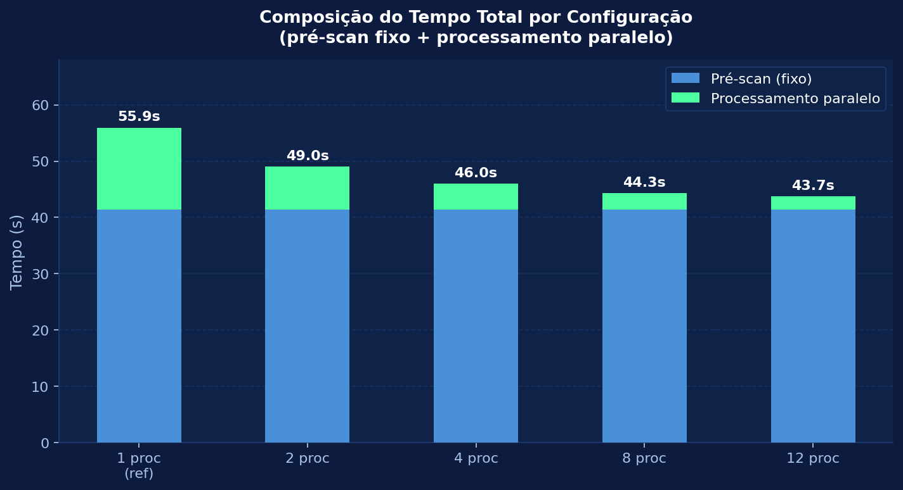
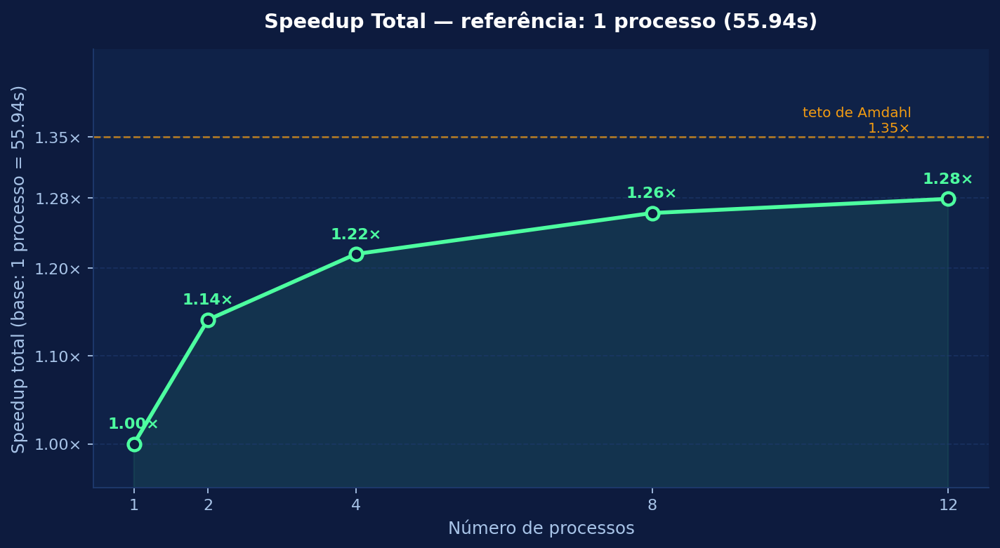
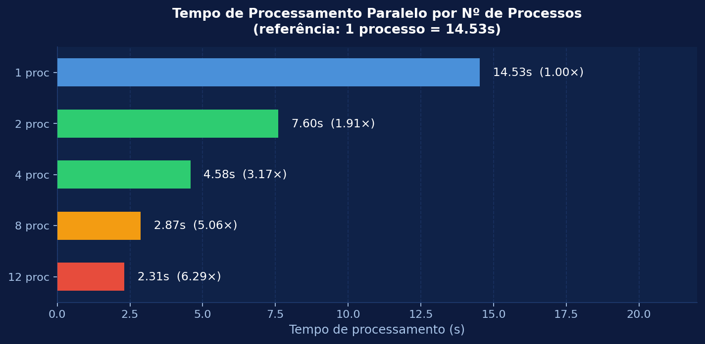
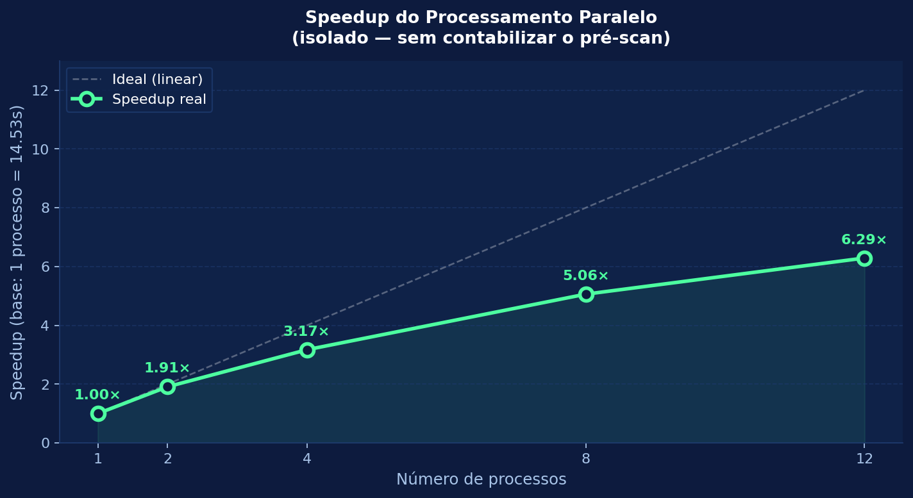
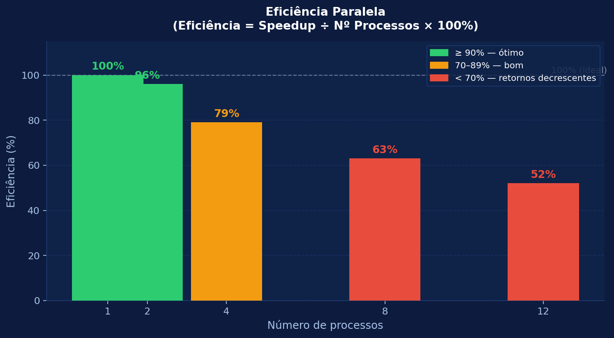

# Trabalho 2º Bimestre — Programação Concorrente e Distribuída

**Paralelismo com Multiprocessing: onde o ganho satura**

Análise paralela de 8 GB de dados de abate bovino do IBGE (Tabela 1092) — escalando de 1 a 12 processos e investigando o gargalo de escalabilidade.

| | |
|---|---|
| **Alunos** | Felipe (RA 078364) · Gustavo (RA 077030) |
| **Professor** | Rafael Marconi |
| **Disciplina** | Programação Concorrente e Distribuída — 2º Bimestre 2026 |
| **Speedup máximo** | **6.29×** de processamento (12 processos vs. 1 processo) |

---

## Por que essa solução importa no mundo real

Imagina que você é **analista de uma empresa** (ou jornalista, ou de um órgão público) e te entregam um arquivo de 8 GB do governo e dizem: *"me diz quais estados mais abatem gado e como isso evoluiu."*

Você tem 3 caminhos:

| Caminho | O que acontece | Custo real |
|---|---|---|
| **Abrir no Excel** | Trava. Excel não aguenta. | Impossível |
| **Subir pra cloud / banco / Spark** | Precisa de conta AWS, configurar cluster, pagar por hora, esperar TI liberar | Dinheiro + dias de espera + alguém que saiba |
| **Nossa solução** | Roda no seu próprio notebook, em ~45 segundos, com Python puro | R$ 0, na sua mesa, agora |

**Por que é melhor no mundo real:** porque resolve o problema **sem infraestrutura, sem custo e sem depender de ninguém.** Você não precisa de cloud, não precisa de servidor, não precisa instalar nada, não precisa pedir pra TI. Abre o terminal e roda.

### Os 3 ganhos concretos que importam

**1. Não custa dinheiro.**
Cloud cobra por hora de máquina e por GB processado. Banco de dados precisa de servidor. A nossa solução roda no hardware que a pessoa **já tem** — um notebook comum. Pra uma análise pontual, montar infraestrutura paga é desperdício total.

**2. Não trava por falta de memória.**
O jeito normal de paralelizar em Python (mandar os dados entre processos) **estoura a RAM** e o programa morre. Acontece de verdade, o tempo todo, com gente que tenta. A nossa lê direto do disco — funciona num PC de 16 GB processando um arquivo de 8 GB, que tecnicamente "não caberia".

**3. É rápido o suficiente pra ser usável.**
~44 segundos com 12 processos muda o comportamento de quem usa: vira algo que você roda **várias vezes**, testando perguntas diferentes, sem cafezinho no meio. Velocidade não é vaidade — é o que torna a ferramenta prática.

---

## Sumário

1. [Dados](#dados)
2. [Filtros Implementados](#filtros-implementados)
3. [Arquitetura da Solução](#arquitetura-da-solução)
4. [Por que Processos e não Threads?](#por-que-processos-e-não-threads)
5. [Como Executar](#como-executar)
6. [Saída dos Filtros](#saída-dos-filtros)
7. [Resultados de Tempo e Speedup](#resultados-de-tempo-e-speedup)
8. [Eficiência e Saturação](#eficiência-e-saturação)
9. [Por que o Speedup Satura?](#por-que-o-speedup-satura)
10. [Como Romper o Teto](#como-romper-o-teto)
11. [Configuração da Máquina](#configuração-da-máquina)

---

## Dados

**Arquivo:** `tabela.csv`

**Fonte:** IBGE — *Número de informantes, Quantidade e Peso total das carcaças dos bovinos abatidos, no mês e no trimestre, por tipo de rebanho e tipo de inspeção.*

> ⚠️ **O arquivo CSV não está incluso no repositório** (8 GB — acima do limite do Git).
> Disponível para download no **[Google Drive](https://drive.google.com/file/d/1j5z0Tstp23AOCbXARNGulNlY9LMYXGNC/view?usp=sharing)**.
>
> **Como obter:**
> 1. Acesse o link acima e baixe o arquivo `.zip`
> 2. Descompacte o zip
> 3. Mova o arquivo `tabela.csv` para dentro desta pasta (raiz do projeto)
> 4. Execute com `python3 paralelizado.py`

O arquivo contém **6 seções de variáveis**, cada uma com dados trimestrais de **Q1 1997 a Q4 2025** (116 trimestres, 29 anos). Este trabalho usa apenas duas seções:

- **Animais abatidos (Cabeças)** — 1.382 MB · 86.864 linhas de dados
- **Peso total das carcaças (Quilogramas)** — 1.621 MB · 86.864 linhas de dados

Cada linha representa uma combinação de:

| Campo | Valores possíveis |
|---|---|
| Nível | `BR` (Brasil), `UF` (Estado), `MU` (Município) |
| Local | Brasil, São Paulo, Mato Grosso... |
| Tipo de inspeção | `Total`, `Federal`, `Estadual`, `Municipal` |

Cada linha tem **~2.800 colunas**: 3 metadados + dados mensais de 116 trimestres × 6 colunas/trimestre (total, 3 meses individuais, acumulado trimestral, acumulado anual). A função `calcular_por_ano` lê os **3 meses individuais** de cada trimestre — **348 leituras por linha**.

---

## Filtros Implementados

### Filtro 1 — Abate por Estado

Percorre a seção **Animais abatidos**, seleciona apenas as linhas onde:
- Nível = `UF` (uma linha por estado)
- Inspeção = `Total`

Para cada uma dessas 27 linhas, soma todos os abates mês a mês de 1997 a 2025 (348 leituras) e acumula por estado. Resultado: ranking de volume de abate por UF no período inteiro.

### Filtro 2 — Evolução Anual do Brasil

Percorre a seção **Animais abatidos**, seleciona apenas:
- Nível = `BR`
- Inspeção = `Total`

Agrega os abates mensais por ano para obter o total anual de cabeças abatidas no Brasil. Revela a tendência histórica do setor — crescimento, quedas, picos — de 1997 a 2025.

### Filtro 3 — Peso Total das Carcaças por Região

Usa a seção **Peso das carcaças**. Seleciona linhas onde:
- Nível = `UF`
- Inspeção = `Total`

Soma o peso em kg de cada estado e agrupa pelos 5 grupos regionais do Brasil:

| Região | Estados |
|---|---|
| Norte | RO, AC, AM, RR, PA, AP, TO |
| Nordeste | MA, PI, CE, RN, PB, PE, AL, SE, BA |
| Sudeste | MG, ES, RJ, SP |
| Sul | PR, SC, RS |
| Centro-Oeste | MS, MT, GO, DF |

### Filtro 4 — Federal × Estadual × Municipal

Percorre **Animais abatidos**, seleciona:
- Nível = `BR`
- Inspeção = `Federal`, `Estadual` ou `Municipal`

Compara o volume total de abates fiscalizados por cada esfera sanitária, mostrando qual domina no período.

---

## Arquitetura da Solução

```
CSV (8 GB)
    │
    ▼
┌─────────────────────────────────────────────────────────┐
│  PRÉ-SCAN SERIAL  (~41s, executado UMA única vez)       │
│  Leitura sequencial do arquivo inteiro para registrar   │
│  apenas os offsets em bytes das duas seções relevantes. │
│  Armazena só 4 inteiros — não carrega linhas na RAM.    │
└───────────────────┬─────────────────────────────────────┘
                    │  4 offsets (ab_inicio, ab_fim,
                    │             pe_inicio, pe_fim)
                    ▼
┌─────────────────────────────────────────────────────────┐
│  DIVISÃO EM N FATIAS                                    │
│  Cada seção é dividida em N trechos alinhados a linhas  │
│  completas. Cada worker recebe apenas 4 inteiros.       │
└───────┬───────┬───────┬───────────────────────────────┘
        │       │       │
        ▼       ▼       ▼
   worker 1  worker 2  worker N
   lê+filtra lê+filtra lê+filtra
   sua fatia  sua fatia  sua fatia
   do disco   do disco   do disco
        │       │       │
        └───────┴───────┘
                │
                ▼
┌─────────────────────────────────────────────────────────┐
│  AGREGAÇÃO                                              │
│  Processo principal soma os N dicionários parciais      │
│  e exibe os resultados finais dos 4 filtros.            │
└─────────────────────────────────────────────────────────┘
```

**Ponto-chave — workers recebem coordenadas, não dados.**
O pickle (mecanismo de transferência entre processos) transfere ~50 bytes por worker em vez de ~1.2 GB de listas Python. Isso elimina o gargalo de serialização que trava a abordagem ingênua.

**Filtro antecipado.**
Antes de chamar `calcular_por_ano` (que executa 348 `parse_val` por linha), o worker verifica se a linha é relevante para algum filtro. Linhas de nível `MU` ou inspeções não usadas recebem um `continue` imediato — eliminando o trabalho desnecessário que era o principal gargalo de CPU.

---

## Por que Processos e não Threads?

Em Python, o **GIL (Global Interpreter Lock)** permite que apenas **uma thread execute código Python por vez**. Para trabalho de CPU, threads ficam em fila e não produzem ganho real.

Testado em máquina real com `threading.Thread`:

```
2 threads  →  135s   (sem ganho)
4 threads  →  130s
8 threads  →  138s
12 threads →  143s   (pior ainda — overhead de troca)
```

`multiprocessing` cria processos **independentes**, cada um com seu próprio interpretador e seu próprio GIL. Resultado: paralelismo real em núcleos físicos distintos da CPU.

---

## Como Executar

> **Requisito:** Python 3.8+ (sem dependências externas — apenas biblioteca padrão)

```bash
python3 paralelizado.py
```

O script espera que `tabela.csv` esteja na mesma pasta. Ele roda automaticamente as 5 configurações (1, 2, 4, 8 e 12 processos) e exibe uma tabela comparativa de speedup ao final. Tempo total de execução: ~10 minutos.

---

## Saída dos Filtros

Os resultados abaixo são os mesmos em todas as configurações de processo — apenas o tempo muda. Verificação de correção: resultados idênticos em 1, 2, 4, 8 e 12 processos.

### Filtro 1 — Abate por Estado (1997–2025)

27 estados · seção Animais abatidos · nível UF · inspeção Total

```
Estado                     Total de Cabeças  Rank
------------------------- --------------------  ----
Mato Grosso                       122,762,054  #1
São Paulo                          99,540,469  #2
Mato Grosso do Sul                 99,224,097  #3
Goiás                              82,319,353  #4
Minas Gerais                       67,817,041  #5
Pará                               60,983,839  #6
Rondônia                           50,100,480  #7
Rio Grande do Sul                  48,672,862  #8
Paraná                             36,212,305  #9
Bahia                              27,310,750  #10
Tocantins                          26,350,853  #11
Maranhão                           17,694,406  #12
Santa Catarina                     11,429,642  #13
Acre                               10,201,127  #14
Pernambuco                          9,385,709  #15
Espírito Santo                      7,574,735  #16
Ceará                               7,561,179  #17
Rio de Janeiro                      4,210,543  #18
Alagoas                             4,183,911  #19
Amazonas                            4,052,145  #20
Piauí                               3,745,560  #21
Rio Grande do Norte                 2,403,450  #22
Sergipe                             2,303,079  #23
Paraíba                             1,567,637  #24
Roraima                             1,446,643  #25
Distrito Federal                      233,475  #26
Amapá                                  60,864  #27
```

> Centro-Oeste domina o abate nacional — MT, MS e GO somam ~37% do total. SP aparece em 2º como principal estado do Sudeste.

### Filtro 2 — Evolução Anual do Brasil (1997–2025)

29 anos · nível BR · inspeção Total

```
  Ano    Total de Cabeças  Var. s/ ano ant.
------  ------------------  ----------------
  1997          14,886,260                 —
  1998          14,906,476           +20,216
  1999          16,787,016        +1,880,540
  2000          17,085,581          +298,565
  2001          18,436,299        +1,350,718
  2002          19,924,046        +1,487,747
  2003          21,644,403        +1,720,357
  2004          25,936,697        +4,292,294   ← maior alta até então
  2005          28,030,409        +2,093,712
  2006          30,373,560        +2,343,151
  2007          30,712,914          +339,354
  2008          28,700,370        -2,012,544   ← crise financeira global
  2009          28,062,688          -637,682
  2010          29,278,095        +1,215,407
  2011          28,823,944          -454,151
  2012          31,118,740        +2,294,796
  2013          34,412,070        +3,293,330   ← pico histórico até 2023
  2014          33,907,718          -504,352
  2015          30,651,802        -3,255,916   ← crise econômica BR
  2016          29,702,048          -949,754
  2017          30,866,663        +1,164,615
  2018          32,042,688        +1,176,025
  2019          32,445,850          +403,162
  2020          29,887,036        -2,558,814   ← pandemia COVID-19
  2021          27,704,853        -2,182,183
  2022          29,947,584        +2,242,731
  2023          34,101,806        +4,154,222
  2024          39,689,184        +5,587,378   ← maior alta histórica
  2025          42,935,146        +3,245,962   ← novo recorde
```

> O setor cresceu ~2.9× em 29 anos (14.9M → 42.9M cabeças). Quedas visíveis coincidem com crises econômicas (2008, 2015, 2020).

### Filtro 3 — Peso Total das Carcaças por Região (kg)

Total acumulado: **196,848,109,012 kg** (≈ 197 bilhões de kg)

```
Região           Peso Total (kg)       % do Brasil
--------------- ----------------------  -----------
Centro-Oeste     76,057,045,496          38.6%
Sudeste          44,147,994,809          22.4%
Norte            37,105,321,815          18.8%
Sul              21,944,611,950          11.1%
Nordeste         17,593,134,942           8.9%
```

Gráfico de proporção:

```
Centro-Oeste  |██████████████████████████████████████▌  38.6%
Sudeste       |██████████████████████▍                  22.4%
Norte         |██████████████████▊                      18.8%
Sul           |███████████                              11.1%
Nordeste      |████████▉                                 8.9%
```

> Centro-Oeste concentra quase 4 em cada 10 kg de carcaça produzidos no Brasil — reflexo da pecuária extensiva do Cerrado.

### Filtro 4 — Federal × Estadual × Municipal

Total fiscalizado: **813,001,946 cabeças**

```
Inspeção      Total de Cabeças       % do Total
------------ ----------------------  ----------
Federal             613,702,051         75.5%
Estadual            146,809,321         18.1%
Municipal            52,490,574          6.5%
```

Gráfico:

```
Federal    |███████████████████████████████████████████████████████████████████████████  75.5%
Estadual   |██████████████████                                                           18.1%
Municipal  |██████▌                                                                       6.5%
```

> 3 de cada 4 cabeças abatidas passam pelo SIF (Serviço de Inspeção Federal). O Serviço de Inspeção Estadual (SIE) cobre a maior parte do restante.

---

## Resultados de Tempo e Speedup

### Execução Paralela (18/06/2026)

O pré-scan é feito **uma única vez** antes de todas as rodadas. A referência de speedup é **1 processo** — o mesmo algoritmo rodando sem paralelismo.

```
Configuração    Pré-scan (s)   Proc. (s)   Total (s)   Speedup proc.   Speedup total
--------------  ------------   ---------   ---------   -------------   -------------
1 processo            41.41       14.53       55.94        ref (1.00×)     ref (1.00×)
2 processos           41.41        7.60       49.01           1.91×           1.14×
4 processos           41.41        4.58       45.99           3.17×           1.22×
8 processos           41.41        2.87       44.29           5.06×           1.26×
12 processos          41.41        2.31       43.73           6.29×           1.28×
```

> **Speedup proc.** = ganho na fase paralela (14.53s → 2.31s).
> **Speedup total** = ganho no tempo total incluindo o pré-scan fixo de 41.41s.
> O pré-scan domina o tempo total — por isso o speedup total satura em ~1.28×.

### Composição do tempo total (pré-scan + processamento)



### Speedup total vs. serial



### Tempo de processamento paralelo (sem pré-scan)

Isolando apenas a fase paralela — referência: 1 processo = 14.53s



### Speedup do processamento paralelo



> O processamento caiu de 14.53s para 2.31s — uma redução de 6.3×. Porém, como veremos na seção seguinte, ele agora representa apenas ~5% do tempo total, sendo dominado pelo pré-scan de 41s.

---

## Eficiência e Saturação

A **eficiência** mede o quanto de cada processo adicionado é realmente aproveitado:

```
Eficiência = Speedup ÷ Nº de processos × 100%
Ideal = 100% (speedup linear)
```

### Tabela de Eficiência — Processamento Paralelo

| Processos | Tempo (s) | Speedup | Eficiência | Interpretação |
|:---------:|----------:|--------:|-----------:|---|
| 1 | 14.53 | 1.00× | **100%** | base |
| 2 | 7.60 | 1.91× | **96%** | quase perfeito — CPU é o limite, núcleos sobrando |
| 4 | 4.58 | 3.17× | **79%** | bom — começa a aparecer concorrência por disco |
| 8 | 2.87 | 5.06× | **63%** | joelho da curva — hyperthreads entram em jogo |
| 12 | 2.31 | 6.29× | **52%** | retornos decrescentes — metade da capacidade adicionada se perde |

### Gráfico de Eficiência



### Por que a eficiência cai?

A cada processo adicionado, o ganho marginal diminui porque:

1. **2 → 4 processos:** +0.84 de ganho por processo adicionado
2. **4 → 8 processos:** +0.47 de ganho por processo adicionado
3. **8 → 12 processos:** +0.31 de ganho por processo adicionado

Este é o comportamento clássico previsto pela **Lei de Amdahl**: quanto mais a parte paralela é otimizada, mais a parte serial domina o tempo total.

---

## Por que o Speedup Satura?

Quatro causas físicas convergem:

### Causa 1 — Lei de Amdahl (pré-scan fixo) ← dominante

O pré-scan serial de **41.41s** não encolhe com mais processos. Com 12 processos, ele representa **94.7% do tempo total**.

**Teto teórico de Amdahl** (usando 1 processo como base):
```
Teto total = T_1proc / T_prescan = 55.94 / 41.41 = 1.35×
```
Já alcançamos **1.28× = 95% do teto** — o gargalo é o pré-scan fixo, não bug ou má implementação.

O processamento em si escala bem: **6.29× com 12 processos** (14.53s → 2.31s), mas como representa apenas ~26% do tempo total, o impacto no resultado final é limitado.

### Causa 2 — Pré-scan é I/O-bound ← dominante

O volume a ler é fixo (~8 GB) e o disco tem **banda máxima**. A leitura sequencial única já consome 41s — um limite físico de hardware, não de código. Nenhuma otimização de software reduz esse número sem mudar o formato dos dados ou o disco.

### Causa 3 — Limite de núcleos físicos

O i5-12500 tem **12 núcleos físicos** e 20 threads. Até ~12 processos há paralelismo real em núcleos distintos. Com mais processos do que núcleos físicos, os extras competem pelos mesmos núcleos — por isso a eficiência despenca de 79% para 52%.

### Causa 4 — Banda de memória

Todos os núcleos disputam o **mesmo barramento de RAM**. Criar milhões de objetos `str`/`float` por linha satura a banda — outro recurso compartilhado que não escala linearmente com mais processos.

### Visualização — Composição do Tempo Total

```
                   pré-scan (fixo)       processamento paralelo
                   ───────────────────── ──────────────────────
1 processo (55.9s) [█████████████████████][█████████████]
2 processos (49s)  [█████████████████████][███████]
4 processos (46s)  [█████████████████████][████]
8 processos (44.3s)[█████████████████████][███]
12 proc (43.7s)    [█████████████████████][██]
                    ↑ este bloco não encolhe — é o teto
```

---

## Como Romper o Teto

Para ir além de ~44s o gargalo a atacar é o **pré-scan I/O-bound de 41s**, não o processamento paralelo:

| Estratégia | Impacto | Dificuldade |
|---|---|---|
| **Converter para Parquet/binário** | Reduz I/O do pré-scan diretamente — menos bytes = scan mais rápido | Média |
| **Sobrepor pré-scan e processamento** | Pipeline: enquanto o disco varre um trecho, workers já processam o anterior — CPU não fica ociosa | Alta |
| **Distribuir entre máquinas (MPI/Spark)** | Cada nó lê de seu próprio disco — banda de I/O escala de verdade | Alta |
| **SSD NVMe em vez de SATA/HDD** | Eleva diretamente a banda de leitura, encurtando o pré-scan | Baixa (hardware) |
| **Limitar a ~12 processos** | Usar o nº de núcleos físicos reais — além disso a eficiência cai sem ganho proporcional | Imediata |
| **Vetorizar com NumPy** | `calcular_por_ano` faz 348 iterações/linha — NumPy reduziria tempo de parsing | Média |

---

## Estrutura dos Arquivos

```
.
├── tabela.csv              # dados brutos (IBGE, 8 GB) — não versionado
├── paralelizado.py         # implementação paralela com processos (1, 2, 4, 8, 12)
├── evidencias/             # saídas de execuções anteriores
│   ├── saida_paralelizado_2026-06-01.txt
│   └── saida_paralelizado_2026-06-15.txt
├── prints/                 # gráficos de desempenho
│   ├── composicao_tempo.png
│   ├── speedup_total.png
│   ├── speedup_processamento.png
│   ├── tempo_processamento.png
│   ├── eficiencia.png
│   └── gerar_graficos.py   # script para regenerar os gráficos
└── README.md
```

---

## Configuração da Máquina

| Componente | Especificação |
|---|---|
| **Processador** | Intel Core i5-12500 |
| **Núcleos / Threads** | 12 núcleos físicos / 20 threads |
| **RAM** | 16 GB |
| **GPU** | Intel UHD Graphics 770 |
| **Sistema Operacional** | Windows |
| **Python** | 3.13 |

> Todos os tempos medidos nesta máquina. Máquinas com SSD NVMe ou mais núcleos físicos produzirão tempos absolutos diferentes, mas a saturação de eficiência seguirá o mesmo padrão.

---

## Conclusão

- **6.29× de speedup de processamento** com 12 processos vs. 1 processo (14.53s → 2.31s)
- **1.28× de speedup total** — limitado pelo pré-scan fixo de 41.41s que representa 95% do teto de Amdahl
- **96% de eficiência com 2 processos** — o ponto de melhor custo-benefício
- O teto de Amdahl (1.35×) já está 95% alcançado — o gargalo é o pré-scan fixo, não bug ou má implementação
- **Romper o teto exige distribuir o I/O ou reduzir os bytes lidos** — não mais processos na mesma máquina
